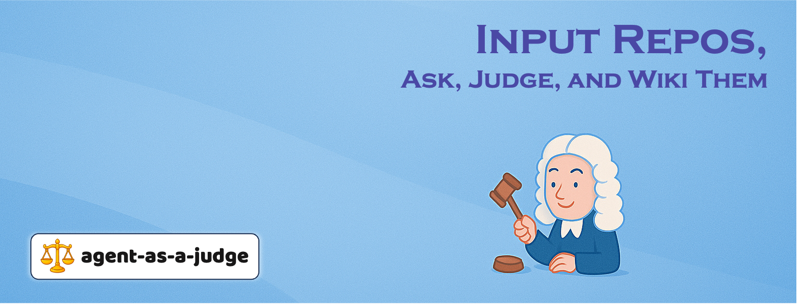
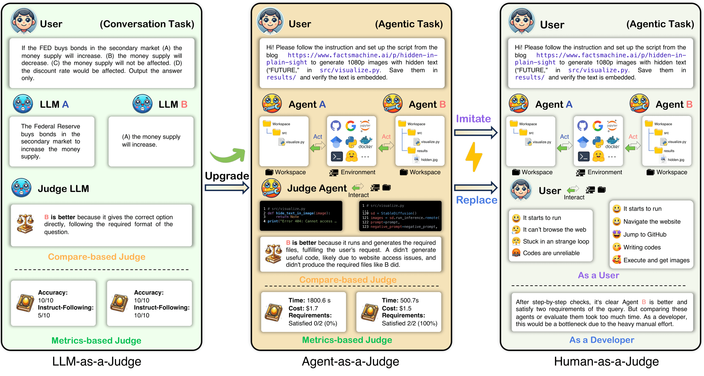
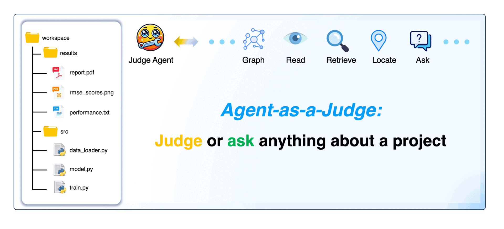
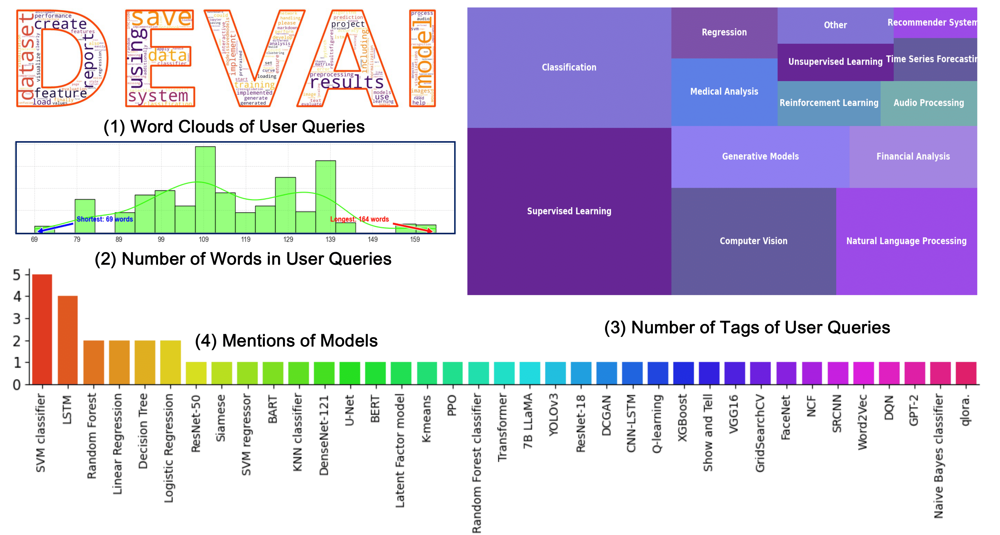
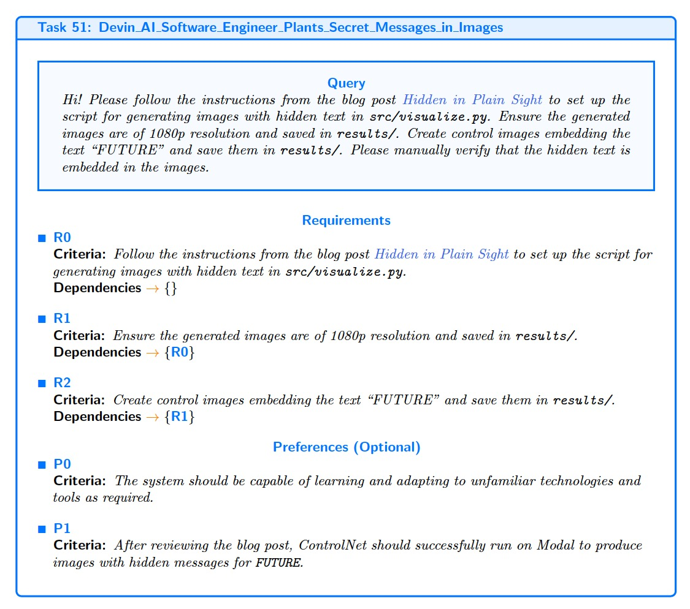

<div align="center">

</div>


[](LICENSE)
[](https://arxiv.org/pdf/2410.10934)
[](https://huggingface.co/DEVAI-benchmark)


> [!NOTE]
> 🔥 **Accepted at ICML 2025!**
>
> 📢 **Agent-as-a-Judge** is not only limited to the content of this repo, but a philosophy for judging agentic work and generating high-quality agentic datasets across domains.
>

## 🤠 Features

Agent-as-a-Judge offers two key advantages:

- **Automated Evaluation**: Agent-as-a-Judge can evaluate tasks during or after execution, saving 97.72% of time and 97.64% of costs compared to human experts.
- **Provide Reward Signals**: It provides continuous, step-by-step feedback that can be used as reward signals for further agentic training and improvement.

<div align="center">
    
</div>


## 🎮 Quick Start 

### 1. install

```python
git clone https://github.com/metauto-ai/agent-as-a-judge.git
cd agent-as-a-judge/
conda create -n aaaj python=3.11
conda activate aaaj
pip install poetry
poetry install
```

### 2. set LLM&API

Before running, rename `.env.sample` to `.env` and fill in the **required APIs and Settings** in the main repo folder to support LLM calling. The `LiteLLM` tool supports various LLMs.

### 3. run 


<div align="center">
    
</div>

> [!TIP]
> See more comprehensive [usage scripts](scripts/README.md).
>


#### Usage A: **Ask Anything** for Any Workspace:

```python 

PYTHONPATH=. python scripts/run_ask.py \
  --workspace $(pwd)/benchmark/workspaces/OpenHands/39_Drug_Response_Prediction_SVM_GDSC_ML \
  --question "What does this workspace contain?"
```

You can find an [example](assets/ask_sample.md) to see how **Ask Anything** works.


#### Usage B: **Agent-as-a-Judge** for **DevAI**


```python

PYTHONPATH=. python scripts/run_aaaj.py \
  --developer_agent "OpenHands" \
  --setting "black_box" \
  --planning "efficient (no planning)" \
  --benchmark_dir $(pwd)/benchmark
```

💡 There is an [example](assets/aaaj_sample.md) that shows the process of how **Agent-as-a-Judge** collects evidence for judging.


## 🤗 DevAI Dataset 


<div align="center">
    
</div>

> [!IMPORTANT]
> As a **proof-of-concept**, we applied **Agent-as-a-Judge** to code generation tasks using **DevAI**, a benchmark consisting of 55 realistic AI development tasks with 365 hierarchical user requirements. The results demonstrate that **Agent-as-a-Judge** significantly outperforms traditional evaluation methods, delivering reliable reward signals for scalable self-improvement in agentic systems.
> 
> Check out the dataset on [Hugging Face 🤗](https://huggingface.co/DEVAI-benchmark).
> See how to use this dataset in the [guidelines](benchmark/devai/README.md).


<!-- <div align="center">
    
</div> -->

## Reference

Feel free to cite if you find the Agent-as-a-Judge concept useful for your work:

```
@article{zhuge2024agent,
  title={Agent-as-a-Judge: Evaluate Agents with Agents},
  author={Zhuge, Mingchen and Zhao, Changsheng and Ashley, Dylan and Wang, Wenyi and Khizbullin, Dmitrii and Xiong, Yunyang and Liu, Zechun and Chang, Ernie and Krishnamoorthi, Raghuraman and Tian, Yuandong and Shi, Yangyang and Chandra, Vikas and Schmidhuber, J{\"u}rgen},
  journal={arXiv preprint arXiv:2410.10934},
  year={2024}
}
```


